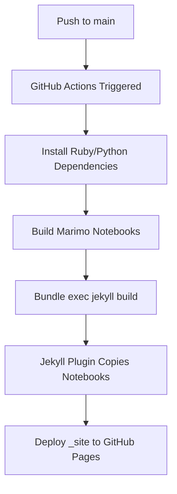

# GitHub Pages Deployment Strategy

## Overview

This site uses **GitHub Actions** to build and deploy to GitHub Pages, which allows:
- ✅ Custom Jekyll plugins (jekyll-scholar, custom hooks)
- ✅ Python/marimo notebook building
- ✅ Full control over build process

## Why Not Standard GitHub Pages?

Standard GitHub Pages (push to `gh-pages` branch) only supports [a limited set of plugins](https://pages.github.com/versions/). This site requires:
- `jekyll-scholar` for bibliography
- Custom plugins for notebook building, cache busting, etc.

## Deployment Flow



### Step-by-Step:

1. **Trigger** - Push to `main` branch or manual workflow dispatch

2. **Setup** (`.github/workflows/deploy.yml`):
   - Checkout code
   - Setup Ruby, Python, Node.js
   - Install dependencies from `Gemfile`, `requirements.txt`, `package.json`

3. **Build Marimo Notebooks** (Manual step):
   ```bash
   python build_notebooks.py
   ```
   - Exports `.py` notebooks to `.html` with WASM runtime
   - Copies `data/` and `results/` directories
   - Outputs to `marimo_site/`

4. **Build Jekyll Site**:
   ```bash
   bundle exec jekyll build --baseurl "$BASE_PATH"
   ```
   - Runs custom plugins (including `_plugins/build_marimo_notebooks.rb`)
   - Plugin detects notebooks already built in step 3 (via CI check)
   - Plugin's `:post_write` hook copies `marimo_site/` to `_site/`
   - Outputs to `_site/`

5. **Deploy to GitHub Pages**:
   - Uses `actions/upload-pages-artifact@v3`
   - Deploys `_site/` directory
   - Site available at `https://mitchv34.github.io/`

## Plugin Behavior

### In GitHub Actions (CI=true):
- `:after_init` hook: Skips rebuild if `marimo_site/` exists (already built in step 3)
- `:post_write` hook: Copies `marimo_site/` to `_site/`

### In Local Development:
- `:after_init` hook: Checks file modification times, rebuilds if needed
- `:post_write` hook: Copies `marimo_site/` to `_site/`

## Key Files

### `.github/workflows/deploy.yml`
Main deployment workflow. Key sections:
- `Build marimo notebooks` - Runs `build_notebooks.py`
- `Build with Jekyll` - Runs `bundle exec jekyll build`
- `Verify marimo notebooks in _site` - Checks notebooks were copied
- `Deploy to GitHub Pages` - Uploads and deploys

### `_plugins/build_marimo_notebooks.rb`
Jekyll plugin that:
- Builds notebooks on `:after_init` (if needed)
- Copies notebooks on `:post_write`
- CI-aware: skips rebuild in GitHub Actions if already built

### `build_notebooks.py`
Python script that:
- Exports marimo notebooks to HTML with WASM
- Copies data/results directories
- Generates index page

### `copy_notebooks.sh`
Shell script that copies `marimo_site/` contents to `_site/`

## Verification

After deployment, the workflow verifies:
- ✅ `_site/marimo.html` exists
- ✅ Notebook HTML files present in `_site/`
- ✅ Data files accessible (for WASM notebooks)

Check workflow logs for verification output.

## GitHub Pages Settings

Required repository settings:
- **Source**: GitHub Actions (not Deploy from a branch)
- **Branch**: Actions deploy from `main`
- **Environment**: `github-pages`

To verify: Settings → Pages → Build and deployment → Source: **GitHub Actions**

## Troubleshooting

### Notebooks not appearing on deployed site
1. Check workflow logs for build errors
2. Verify `Build marimo notebooks` step succeeded
3. Check `Verify marimo notebooks in _site` step output

### Plugin errors in GitHub Actions
- Ensure `Gemfile` includes all required gems
- Check Ruby version matches workflow (`ruby: 3.3`)
- Verify plugin is in `_plugins/` directory

### Data files not loading in notebooks
- Ensure files are in `projects/*/data/` or `projects/*/results/`
- Check `build_notebooks.py` copied directories
- Verify WASM-compatible loading pattern in notebook code

## Local Testing

Test the exact same build process locally:

```bash
# Clean build
rm -rf _site marimo_site .jekyll-cache

# Build notebooks
python build_notebooks.py

# Build Jekyll site
JEKYLL_ENV=production bundle exec jekyll build

# Verify notebooks copied
ls -la _site/marimo.html
find _site/projects -name "*.html" | grep notebooks
```

## Security

- ✅ No secrets exposed (uses GitHub tokens automatically)
- ✅ No server-side execution (static HTML + WASM)
- ✅ Data files served as static assets
- ✅ All builds in isolated GitHub Actions runners

## Resources

- [GitHub Pages with GitHub Actions](https://docs.github.com/en/pages/getting-started-with-github-pages/configuring-a-publishing-source-for-your-github-pages-site#publishing-with-a-custom-github-actions-workflow)
- [Jekyll Plugins on GitHub Pages](https://jekyllrb.com/docs/plugins/)
- [Marimo WASM Export](https://docs.marimo.io/guides/exporting.html#webassembly-wasm)
